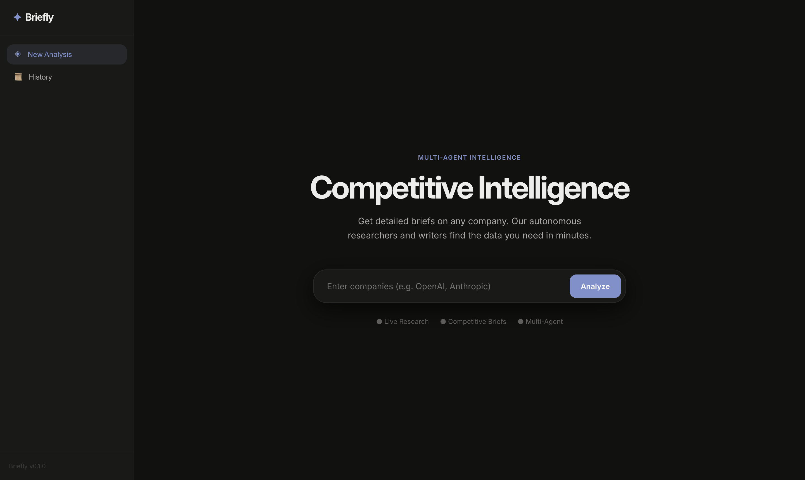
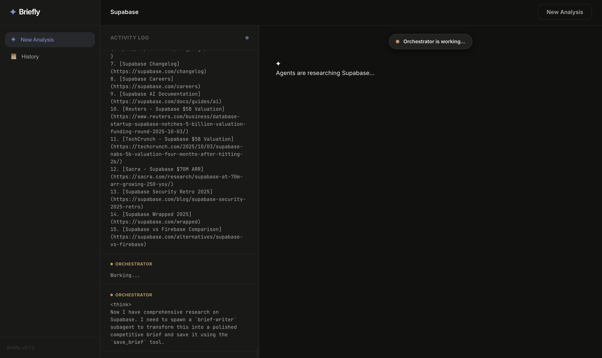
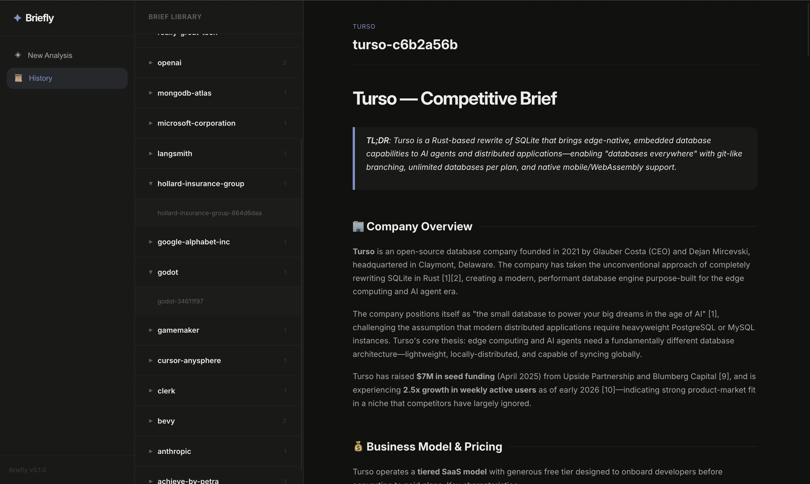
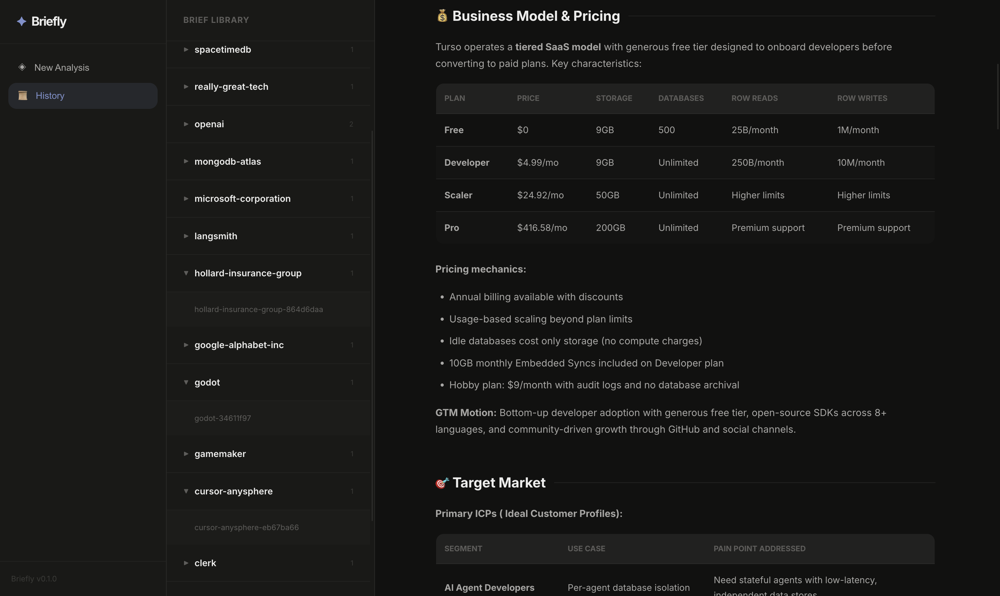
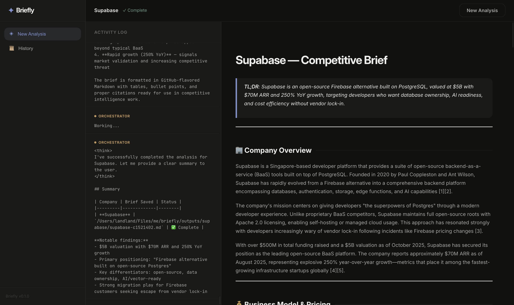

# briefly — Competitive Intelligence Agent

> Give it a company name. It searches the web, reads their site, finds news, job postings, and pricing pages, then writes a structured competitive brief — the kind a startup founder or sales rep would actually use.




## Architecture

```
┌─────────────────────────────────────────────────────────────┐
│                      FastAPI (SSE)                          │
│                     /api/v1/analyse                         │
└───────────────────────────┬─────────────────────────────────┘
                            │
                    ┌───────▼────────┐
                    │  Orchestrator  │  (MiniMax 2.7 via DeepAgents)
                    │  (main agent)  │
                    └──┬────────┬───┘
                       │        │  spawns in parallel
              ┌────────▼──┐  ┌──▼─────────┐
              │ website-  │  │ website-   │
              │ researcher│  │ researcher │  (one per company)
              │ [Stripe]  │  │ [Brex]     │
              └────────┬──┘  └──┬─────────┘
                       │        │  as each completes →
              ┌────────▼──┐  ┌──▼─────────┐
              │  brief-   │  │  brief-    │
              │  writer   │  │  writer    │  (runs concurrently)
              │ [Stripe]  │  │ [Brex]     │
              └────────┬──┘  └──┬─────────┘
                       │        │
                    outputs/stripe/  outputs/brex/
```

### Key design decisions

- **Parallel research + overlapping writes**: the orchestrator spawns all researchers simultaneously. As each completes, a writer is immediately spawned — writers and researchers run concurrently.
- **Context quarantine**: intermediate web search results never touch the orchestrator's context window. Only the final structured research summary propagates up.
- **Virtual filesystem**: briefs are saved to `outputs/<company-slug>/<slug>-<id>.md` by the `save_brief` tool inside the writer subagent.
- **SSE streaming**: all LLM tokens (main agent + each subagent) are streamed via Server-Sent Events. The React frontend renders them in real time with collapsible subagent cards.



## Project structure

```
briefly/
├── app/
│   ├── agents/
│   │   ├── orchestrator.py    # create_deep_agent factory
│   │   ├── subagents.py       # dict-based SubAgent specs
│   │   ├── tools.py           # save_brief tool + tavily_search tool
│   │   ├── mcp.py             # MiniMax MCP client factory
│   │   └── prompts.py         # agent system prompts
│   ├── api/v1/
│   │   ├── routes.py          # FastAPI endpoints + SSE streaming
│   │   └── schemas.py         # Pydantic request/response models
│   ├── core/
│   │   ├── config.py          # Pydantic settings
│   │   ├── llm.py             # LLM_OPTIONS enum + LLM factory
│   │   ├── logging.py         # structlog setup
│   │   ├── middleware.py      # tool call logging middleware
│   │   ├── repository.py      # brief persistence service
│   │   └── tracing.py         # tracing setup
│   └── main.py                # FastAPI app factory
├── frontend/
│   ├── src/
│   │   ├── components/
│   │   │   ├── CompanyInput.tsx
│   │   │   └── SubagentCard.tsx
│   │   ├── hooks/
│   │   │   └── useIntelStream.ts  # SSE streaming hook
│   │   ├── App.tsx
│   │   └── main.tsx
│   ├── index.html
│   ├── package.json
│   └── vite.config.ts
├── outputs/                   # Generated briefs (gitignored)
├── main.py                    # uvicorn entry point
├── pyproject.toml
├── Dockerfile
└── .env.example
```

## Setup

### Prerequisites

- Python ≥ 3.11
- [uv](https://docs.astral.sh/uv/) package manager
- Node.js ≥ 18
- MiniMax API key

### Backend

```bash
# 1. Install dependencies
uv sync

# 2. Configure environment
cp .env.example .env
# Edit .env and set MINIMAX_API_KEY

# 3. Run the server
uv run python main.py
# or with auto-reload:
uv run uvicorn app.main:app --reload --port 8000
```

### Frontend

```bash
cd frontend
npm install
npm run dev        # http://localhost:3000
```

## API

### `POST /api/v1/analyse`

Streams competitive intelligence for one or more companies.

**Request:**
```json
{
  "companies": ["Stripe", "Brex"],
  "thread_id": null,
  "orchestrator_model": "MiniMax-M2.7",
  "researcher_model": "MiniMax-M2.7",
  "writer_model": "MiniMax-M2.7"
}
```

| Field               | Type     | Required | Description                                          |
|---------------------|----------|----------|------------------------------------------------------|
| `companies`         | `string[]` | ✓      | 1-10 company names to analyse                        |
| `thread_id`         | `string`  | ✗       | Optional thread ID to resume existing conversation   |
| `orchestrator_model` | `string`  | ✗       | Model for orchestrator agent (default: from settings)|
| `researcher_model`  | `string`  | ✗       | Model for researcher subagent (default: from settings)|
| `writer_model`      | `string`  | ✗       | Model for writer subagent (default: from settings)   |

**Response:** `text/event-stream` with events:

| Event    | Payload                                              |
|----------|------------------------------------------------------|
| `token`  | `{source, content, ns}` — LLM token                  |
| `update` | `{source, node, ns}` — agent step                    |
| `custom` | `{source, data, ns}` — custom progress               |
| `end`    | `{thread_id, companies, briefs}` — completion       |
| `error`  | `{error}` — failure                                  |

### `GET /api/v1/health`

Health check endpoint.

**Response:**
```json
{
  "status": "ok",
  "version": "0.1.0"
}
```

### `GET /api/v1/briefs`

List all saved briefs. Optional `?company=stripe` filter.

**Response:**
```json
[
  {
    "company": "stripe",
    "path": "outputs/stripe/stripe-a3f9bc12.md",
    "filename": "stripe-a3f9bc12.md"
  }
]
```



### `GET /api/v1/briefs/{company}`

Return the most recent brief content for a company.

**Response:**
```json
{
  "company": "stripe",
  "path": "outputs/stripe/stripe-a3f9bc12.md",
  "content": "# Stripe\n\n## TL;DR\n..."
}
```



## Output format

Briefs are saved as GitHub-flavoured Markdown to:

```
outputs/
  stripe/
    stripe-a3f9bc12.md
  brex/
    brex-7d4e1a09.md
```



Each brief follows this structure:
- TL;DR
- Company Overview
- Business Model & Pricing
- Target Market
- Products & Services
- Recent Developments
- Hiring Signals
- Tech Stack
- Key Differentiators
- Weaknesses & Gaps
- Competitive Implications

## Environment variables

| Variable           | Required | Description                                      |
|--------------------|----------|--------------------------------------------------|
| `MINIMAX_API_KEY`  | Yes      | Required for default models and web-search (MCP) |
| `TAVILY_API_KEY`   | No       | Optional; used for supplemental web research     |
